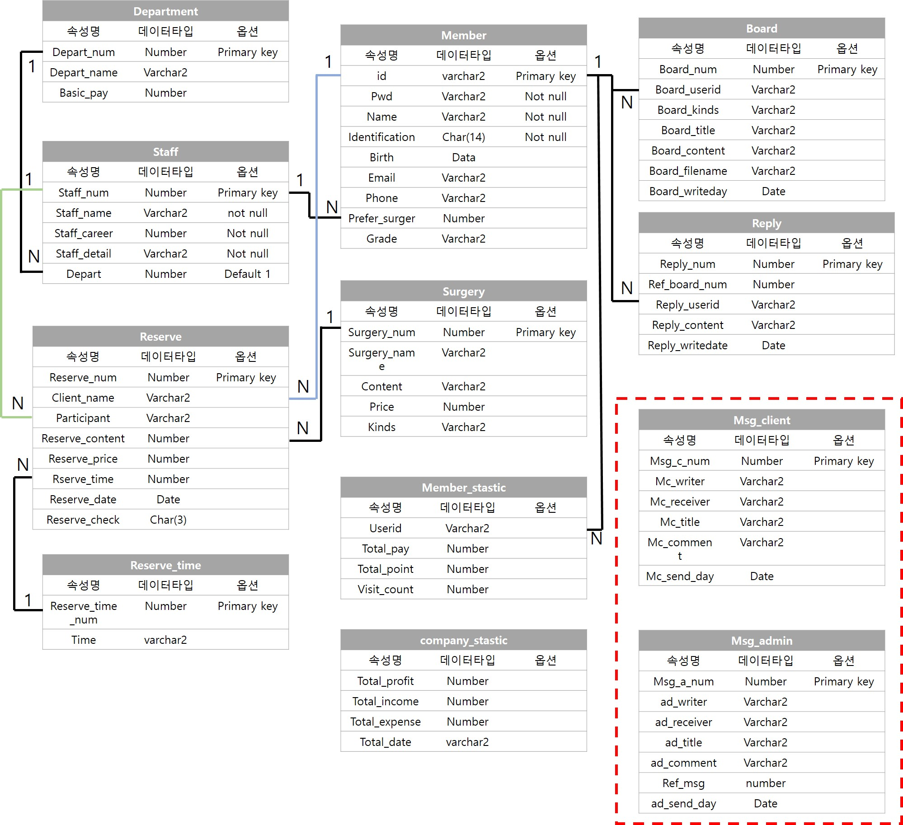

# Waxing Shop

1. SUMMARY
   - Build __Waxing shop__ page.
   - Functions
     - Introduce about Waxing.
     - Management for User(Register, Login).
     - Show All Surgeries of Waxing.
     - Resevation Schedule for Waxing Surgery.
     - Board(User Review)

2. ENVIRONMENTS
   - OS : Windows 7
   - IDE : Eclipse Oxygen.
   - JAVA 1.8 (_Dynamic Web Project_)
   - FrameWork : No Using.
   - DATABASE : Oracle 11g
     - ER tools : Microsoft ACCESS
   - FrontEnd Editor : Atom Editor

4. DATABASE
   - ERM

     </img> 

3. DETAILS FUNCTIONS
   - Introducing about Waxing
     </img> 
     
   - Management for User(Register, Login).
     </img> 
     
   - Show All Sugeries of Waxing
     </img> 
     
   - Resevation Schedule for Waxing Surgery
     </img> 
     
   - Board(User Review)
     </img> 
